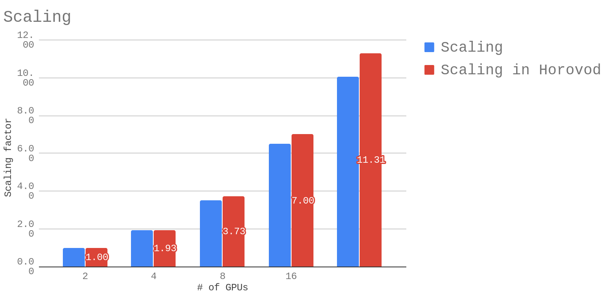
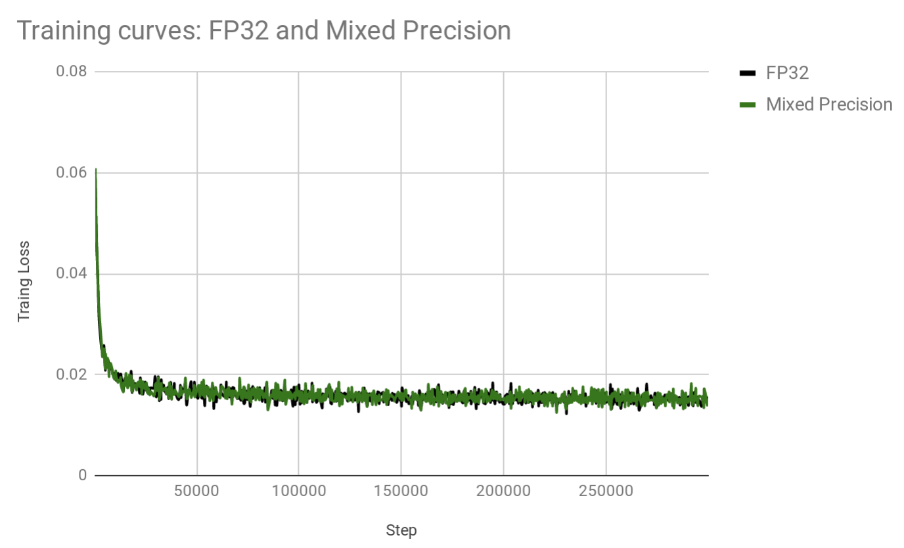
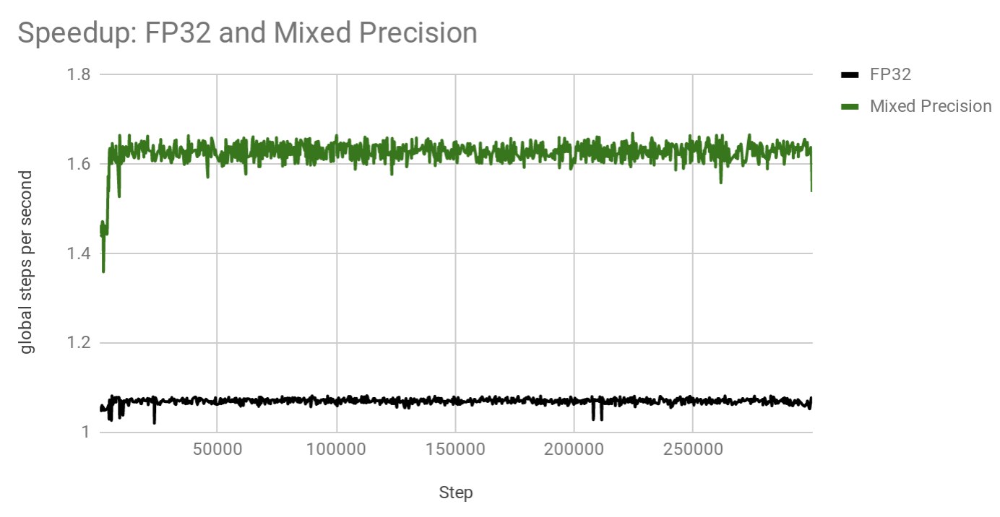

.. _transformer:

Transformer
============

Model
~~~~~

This model is based on `Google Transformer  <https://ai.googleblog.com/2017/08/transformer-novel-neural-network.html>`_
which was introduced in `Attention is all you need  <https://arxiv.org/abs/1706.03762>`_ by A. Vaswani, etal.

Baseline config (base model): `transformer-base.py <https://github.com/NVIDIA/OpenSeq2Seq/tree/master/example_configs/text2text/en-de/transformer-base.py>`_

Transformer model is based solely on attention mechanisms, without any recurrent or convolutional layers.
Common source and target vocabulary is used to share input/output embedding
Tokenization of input and output is done with SentencePiece (`SentencePiece <https://github.com/google/sentencepiece>`_)
It is very good for neural machine translation tasks and base configuration achieves SacreBLEU of 26.4 on WMT 2014 English-to-German translation task ( `checkpoint TBD <tbd>`_ )
while big model gets around 27.5.

Training
~~~~~~~~

It also shows good multi-GPU scalability for transformer models. Below are the scaling factors for base model for batch size of 256 per GPU when training in mixed-precision and using or not using Horovod:

Note that batch size of 256 per GPU results in the total batch size of X*256 when X GPUs are used. For example, if
16 GPUs are used, then the total batch size (or algorithmic batch size) is 16*256=4,096.

Here is an example command of how to train such model on a 4-GPU machine::

 mpirun --allow-run-as-root --mca orte_base_help_aggregate 0 -mca btl ^openib -np 4 -H localhost:4 -bind-to none --map-by slot -x LD_LIBRARY_PATH python run.py --config_file=example_configs/text2text/en-de/transformer-bp-fp32.py --mode=train

Then run inference like this::

 python run.py --config_file=example_configs/text2text/en-de/transformer-bp-fp32.py --mode=infer --infer_output_file=raw_fp32.txt --num_gpus=1 --use_horovod=False

De-tokenize output::

 python tokenizer_wrapper.py --mode=detokenize --model_prefix=wmt16_de_en/m_common --decoded_output=fp32.txt --text_input=raw_fp32.txt

And compute BLEU score::

 cat fp32.txt | sacrebleu -t wmt14 -l en-de > fp32.BLEU

You should get around 26.4 after 300K iterations for the base model.

Mixed Precision
~~~~~~~~~~~~~~~
OpenSeq2Seq allows you to train transformer-based model in mixed precision without changing code or any of the hyper-parameters.
All you need to do is change ``dtype`` in the configuration file to: ``mixed`` and turn on automatic loss scaling: ``"loss_scaling": "Backoff"``.
Below plot demonstrates that training curves for *float32* and *mixed precision* are nearly identical (same hyperparameters are used, only data type differ).

These configurations are trained on 4 GPUs using batch size of 256 per GPU.
While training curves per step look very similar, *mixed precision* model trains significantly faster. See plot below which shows
how many steps per second each model achieves:

Thus, in this particular configuration, *mixed precision* is about *x1.53* times faster. Note that this was measured on a pre-release versions of software.
Your speedups will vary depending on the number of GPUs, batch size per GPU, interconnect between GPUs and software versions.
Since *mixed precision* almost halves memory requirements per GPU, it is sometimes possible to fit a double batch size in *mixed precision* model, therefore,
achieving even bigger speedups.
