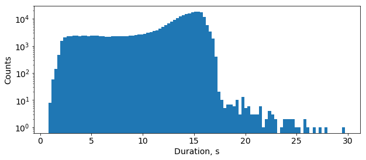

.. _deepspeech2:

DeepSpeech2
============

Model
~~~~~

DeepSpeech2 is a set of speech recognition models based on `Baidu DeepSpeech2 <https://arxiv.org/abs/1512.02595>`_. It is summarized in the following scheme:

.. image:: ds2.png
   :alt: DeepSpeech2 architecture
   :align: center

The preprocessing part takes a raw audio waveform signal and converts it into a log-spectrogram of size (*N_timesteps*, *N_frequency_features*). *N_timesteps* depends on an original audio file's duration, *N_frequency_features* can be assigned in the model's configuration file as "*num_audio_features*" parameter.
 
The Deep Neural Network (DNN) part produces a probability distribution *P_t(c)* over vocabulary characters *c* per each time step *t*.

DeepSpeech2 is trained with CTC loss.

`Word Error Rate (WER) <https://en.wikipedia.org/wiki/Word_error_rate>`_ is the main evaluation metric. In order to get words out of a trained model one needs to use a decoder. Decoder converts a probability distribution over characters into text. There are two types of decoders that are usually employed with CTC-based models: greedy decoder and beam search decoder with language model re-scoring. A greedy decoder outputs the most probable character at each time step. It is very fast and it can produce transcripts that are very close to the original pronunciation. But it may introduce many small misspelling errors. But due to the nature of WER metric, even one character error makes a whole word incorrect. A beam search decoder with language model re-scoring allows checking many possible decodings (beams) at once with assigning a higher score for more probable N-grams according to a given language model. The language model helps to correct misspelling errors. The downside is that it is significantly slower than a greedy decoder. 

One of the best performing on LibriSpeech topologies can be found in `example_configs/speech2text/ds2_large_8gpus.py` configuration file.
It consists of:

* two convolutional layers

  1) number of channels is 32, kernel size is [11, 41], stride is [2, 2]
  2) number of channels is 32, kernel size is [11, 21], stride is [1, 2]
* five bidirectional GRU layers (size is 800)
* one fully connected layer (size is 1600)
* one projection layer (size is number of characters plus 1 for CTC blank symbol, 29)

The model uses spectrograms where number of frequency features is 160 (that is, the frequency range without filtering).

Training
~~~~~~~~
The model was trained with a Stochastic Gradient Descent with Momentum optimizer which was extended with Layer-wise Adaptive Rate Clipping (LARC) algorithm.
The optimizer's parameters are the following:

* learning rate policy is polynomial with initial learning rate = 0.001 and power = 0.5
* momentum is 0.9
* batch size per GPU is 16

L2 weight decay (0.0005), dropout (0.5) and batch normalization were employed for regularization.

In training mode preprocessing augments original audio clips with additive noise and slight time stretching (to make speech faster/slower and increase/decrease its pitch).
Duration of audio samples in LibriSpeech train dataset varies from 0.8 to 30 seconds:

Since 99.05% of the samples are shorter than 16.7 seconds, the preprocessing part ignores longer samples during the training. Such a filtering threshold can be set in the model's configuration file as "*max_duration*" parameter.

Mixed Precision
~~~~~~~~~~~~~~~

Mixed precision training works quite well for DeepSpeech2 even without dynamic loss scaling. It allows us to get the same WER level as float32.

Pre-trained model
~~~~~~~~~~~~~~~~~~

Here is a pre-trained model which was trained for 200 epochs in a mixed precision mode.

.. list-table::
   :widths: 1 1 2 1
   :header-rows: 1

   * - Model description
     - Greedy WER, %
     - Config file
     - Checkpoint

   * - :doc:`DeepSpeech2 </speech-recognition/deepspeech2>`
     - 6.71
     - `ds2_large_8gpus_mp <https://github.com/NVIDIA/OpenSeq2Seq/blob/18.09/example_configs/speech2text/ds2_large_8gpus_mp.py>`_
     - `link <https://drive.google.com/open?id=1EDvL9wMCO2vVE-ynBvpwkFTultbzLNQX>`_

