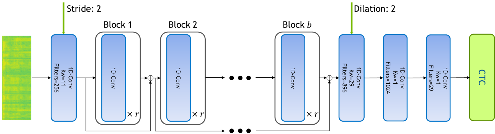
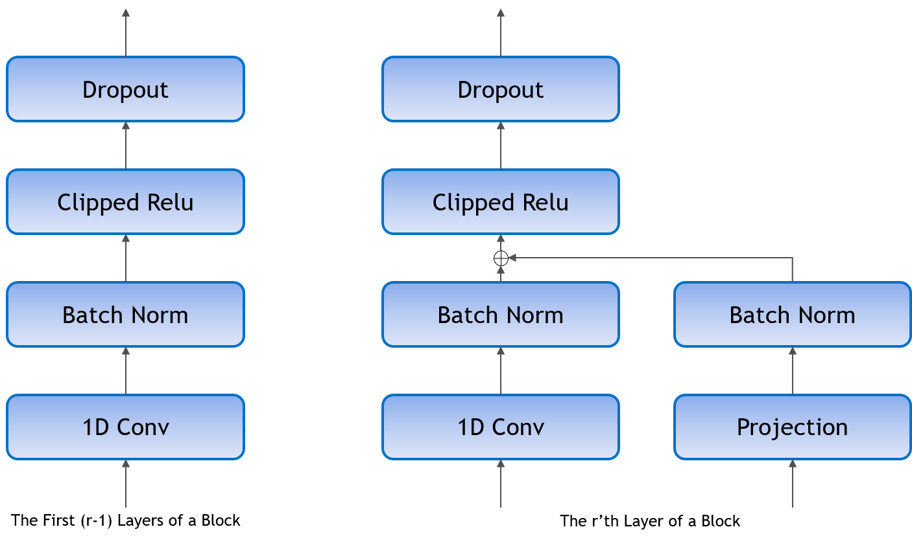

.. _jasper:

Jasper
=======

Model
~~~~~~

Jasper (Just Another Speech Recognizer) is a deep time delay neural network (TDNN) comprising of blocks of 1D-convolutional layers. Jasper is a family of models where each model has a different number of layers. Jasper models are denoted as Jasper bxr where b and r represent:

- b: the number of blocks
- r: the number of repetitions of each convolutional layer within a block

All models have 4 common layers. There is an initial convolutional layer with stride 2 to decrease the time dimension of the speech. The other 3 layers are at the end of the network. The first layer has a dilation of 2 to increase the model's receptive field. The last two layers are fully connected layers that are used to project the final output to a distribution over characters.

Each 1D-convolutional layer consists of a convolutional operation, batch normalization, clipped relu activation, and dropout. Shown on the left.

There is a residual connection between each block which consists of a projection layer, followed by batch normalization. The residual is then added to the output of the last 1D-convolutional layer in the block before the clipped relu activation and dropout. Shown on the right.

We preprocess the speech signal by sampling the raw audio waveform of the signal using a sliding window of 20ms with stride 10ms. We then extract log-mel filterbank energies of size 64 from these frames as input features to the model.

We use Connectionist Temporal Classification (CTC) loss to train the model. The output of the model is a sequence of letters corresponding to the speech input. The vocabulary consists of all alphabets (a-z), space, and the apostrophe symbol, a total of 29 symbols including the blank symbol used by the CTC loss.

Training
~~~~~~~~

Our current best WER is a 54 layer model with dense residual connections. It was trained on the original LibriSpeech dataset augmented with 3-fold speed perturbation and time/frequency masks (similar to `SpecAugment <https://arxiv.org/abs/1904.08779>`_). 
The first row are results using just the acoustic model via greedy decoding.
Jasper can be augmented with language models. We first use a 6-gram language model to guide beam search for the results in the second row.
We used a beam width of 2048. Alpha = 2.0 and beta = -0.2 were used for the clean and the other subsets.
Lastly, we can rescore the top candidates using a neural language model to obtain sub 3% WER on test-clean.

+--------------------------------+-------------------------------------------------+
| Model                          | LibriSpeech Dataset                             |
+                                +-----------+-----------+------------+------------+
|                                | Dev-Clean | Dev-Other | Test-Clean | Test-Other |
+================================+===========+===========+============+============+
| Jasper DR 10x5                 | 3.61      | 11.36     | 3.77       | 11.08      |
+--------------------------------+-----------+-----------+------------+------------+
| Jasper DR 10x5 + 6-gram        | 2.78      | 9.01      | 3.19       | 9.03       |
+--------------------------------+-----------+-----------+------------+------------+
| Jasper DR 10x5 + 6-gram + T XL | 2.58      | 8.10      | 2.86       | 8.17       |
+--------------------------------+-----------+-----------+------------+------------+

The models were trained for 400 epochs on 8 GPUs. We use:

* SGD with momentum = 0.9
* a learning rate with polynomial decay using an initial learning rate of 0.05
* Layer-wise Adative Rate Control (LARC) with eta = 0.001
* weight-decay = 0.001
* dropout (varible per layer: 0.2-0.4)
* 3-fold speed perturbation of [0.9, 1.0, 1.1]
* 2 frequency masks with width up to 6 mel scale bins
* 2 time masks with width up to 6 timesteps (60 ms)

Tips and Tricks
~~~~~~~~~~~~~~~
We have found that the model achieves better WER with longer training but even with a small number of epochs, the model can achieve a good WER. For those with less computational power, we have found that training for 50 epochs will yield sub 5 WER on dev-clean with greedy decoding.

Synthetic Data
~~~~~~~~~~~~~~
More details on older models trained with synthetic data see :ref:`here <synthetic_data>`.

Mixed Precision
~~~~~~~~~~~~~~~

To use mixed precision (float16) during training we made a few minor changes to the model. Tensorflow by default calls Keras Batch Normalization on 3D input (BxTxC) and cuDNN on 4D input (BxHxWxC). In order to use cuDNN's BN we added an extra dimension to the 3D input to make it a 4D tensor (BxTx1xC).

We also use backoff loss scaling.
