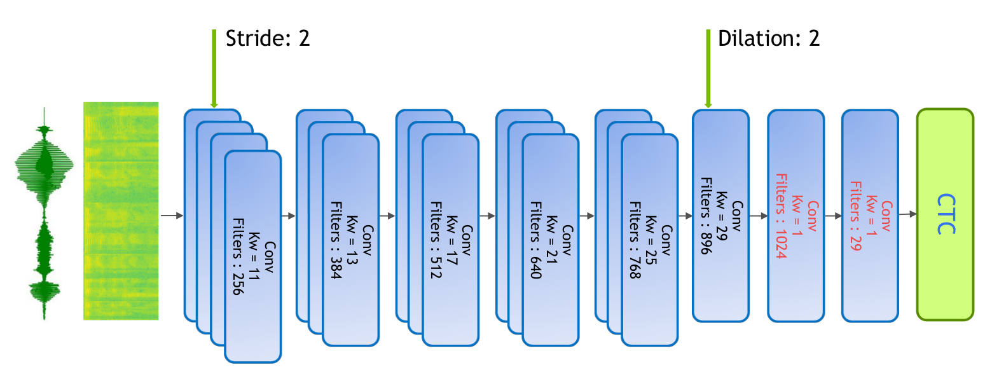

.. _wave2letter:

Wave2Letter+
============

Model
~~~~~

This is a fully convolutional model, based on Facebook's `Wave2Letter <https://arxiv.org/abs/1609.03193>`_ and `Wave2LetterV2 <https://arxiv.org/abs/1712.09444>`_  papers. The base model (`Wave2Letter+ <https://github.com/NVIDIA/OpenSeq2Seq/blob/18.09/example_configs/speech2text/w2lplus_large_8gpus_mp.py>`_) consists of 17 1D-Convolutional Layers and 2 Fully Connected Layers for a total of 19 layers:

We preprocess the speech signal by sampling the raw audio waveform of the signal using a sliding window of 20ms with stride 10ms. We then extract log-mel filterbank energies of size 64 from these frames as input features to the model. 

We use Connectionist Temporal Classification (CTC) loss to train the model. The output of the model is a sequence of letters corresponding to the speech input. The vocabulary consists of all alphabets (a-z), space, and the apostrophe symbol, a total of 29 symbols including the blank symbol used by the CTC loss.  

We made the following changes to the original Wave2letter model:

+ Clipped ReLU instead of Gated Linear Unit (GLU): ReLU allowed to almost half the number of model parameters, without decreasing the Word Error Rate (WER). 
+ Batch normalization(BN) instead of weight normalization (WN): we found that BN is more stable than WN, and the model is less sensitive to the weight intialziation.
+ The CTC loss instead of the Auto SeGmentation (ASG).
+ LARC instead of gradient clipping. 

In addition to this, we use stride 2 in the first convolutional layer. This decreased the time (T) dimension of the sequence, which reduced the model footprint and improved the training time by ~1.6x. 
We have also observed a slight improvement after adding a dilation 2 for the last convolutional layer to increase the receptive-field of the model.
Both striding and dilation improved the WER from 7.17% to 6.67%.

X Large Model
~~~~~~~~~~~~~~
The xlarge models, `Wave2Letter+-34 <https://github.com/NVIDIA/OpenSeq2Seq/blob/18.11-dev/example_configs/speech2text/w2lplus_xlarge_34_8gpus_mp.py>`_ and `Wave2Letter+-54-syn <https://github.com/NVIDIA/OpenSeq2Seq/blob/18.11-dev/example_configs/speech2text/w2lplus_xlarge_54_8gpus_mp.py>`_, are larger models with 34 and 54 layers. The base model contains of 15 convolutional layers which consists of 5 blocks of 3 repeating convolutional layers. For the xlarge model, we double the number of blocks to 10 for the 34 layer model. For the 54 layer model, we further increase the amount of repeating convolutional layers inside each block from 3 to 5.

Synthetic Data
~~~~~~~~~~~~~~
All models with "syn" in their name are trained using a combined dataset of Librispeech and synthetic data. The training details are to be announced. Stay tuned!

Training
~~~~~~~~

Our current best WER is a 54 layer model trained using synthetic data. We achieved a WER of 4.32% on the librispeech test-clean dataset using greedy decoding:

+---------------------+-----------------------------------------------------------------------+
| Model               | LibriSpeech Dataset                                                   |
+                     +-----------------+-----------------+-----------------+-----------------+
|                     | Dev-Clean       |       Dev-Other |      Test-Clean |      Test-Other |
+                     +--------+--------+--------+--------+--------+--------+--------+--------+
|                     | Greedy |  Beam  | Greedy |  Beam  | Greedy |  Beam  | Greedy |  Beam  |
+=====================+========+========+========+========+========+========+========+========+
| W2L+                | 6.67   | 4.77   | 18.68  | 13.88  | 6.58   | 4.92   | 19.61  | 15.01  |
+---------------------+--------+--------+--------+--------+--------+--------+--------+--------+
| W2L+-34             | 5.10   | -      | 15.49  | -      | 5.10   | -      | 16.21  | -      |
+---------------------+--------+--------+--------+--------+--------+--------+--------+--------+
| W2L+-54-syn         | 4.32   | -      | 13.74  | -      | 4.32   | -      | 14.08  | -      |
+---------------------+--------+--------+--------+--------+--------+--------+--------+--------+

We used Open SLR language model while decoding with beam search using a beam width of 2048.

The checkpoint for the model trained using the configuration `w2l_plus_large_mp <https://github.com/NVIDIA/OpenSeq2Seq/blob/18.09/example_configs/speech2text/w2lplus_large_8gpus_mp.py>`_ can be found at `Checkpoint <https://drive.google.com/file/d/10EYe040qVW6cfygSZz6HwGQDylahQNSa/view?usp=sharing>`_.

The base model was trained for 200 epochs on 8 GPUs. We use:

* SGD with momentum = 0.9
* a learning rate with polynomial decay using an initial learning rate of 0.05
* Layer-wise Adative Rate Control (LARC) with eta = 0.001
* weight-decay = 0.001
* dropout (varible per layer: 0.2-0.4) 
* batch size of 32 per GPU for float32 and 64 for mixed-precision.

The xlarge models are trained for 400 epochs on 8 GPUs. All other parameters are kept the same as the base model except:

* we add residual connections between each convolutional block

Mixed Precision
~~~~~~~~~~~~~~~

To use mixed precision (float16) during training we made a few minor changes to the model. Tensorflow by default calls Keras Batch Normalization on 3D input (BxTxC) and cuDNN on 4D input (BxHxWxC). In order to use cuDNN's BN we added an extra dimension to the 3D input to make it a 4D tensor (BxTx1xC). 

The mixed precison model reached the same WER for the same number of steps as float32. The training time decreased by ~1.5x on 8-GPU DGX1 system, and by ~3x on 1-GPU and 4-GPUs when using Horovod.
