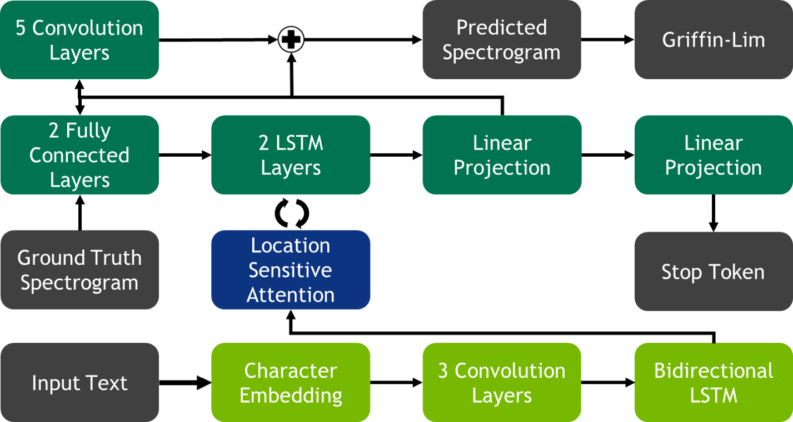

.. _tacotron-2:

Tacotron 2
==========

Model
~~~~~
This model is based on the 
`Tacotron 2 model <https://ai.googleblog.com/2017/12/tacotron-2-generating-human-like-speech.html>`_
(see also `paper <https://arxiv.org/abs/1712.05884>`_). Our implementation mostly
matches what is presented in the paper. There are a few differences listed
below.

The first change is the location of the stop token linear projection layer. In
the paper, it is connected to the output of the decoder rnn. Whereas in our
implementation, it is connected to the output of the spectrogram projection
layer.

We replace zoneout with dropout in the decoder rnn and remove it entirely from
the encoder rnn.

Lastly, the convolutional layer used inside the location layer of the attention
has a kernel size of 32 as opposed to 31 as stated in the tacotron 2 paper.

Model Description
~~~~~~~~~~~~~~~~~~

   Tacotron 2 Model

Tacotron 2 follows a simple encoder decoder structure that has seen great
success in sequence-to-sequence modeling. The encoder is made of three parts.
First a word embedding is learned. The embedding is then passed through a
convolutional prenet. Lastly, the results are consumed by a bi-direction rnn.
The encoder and decoder structure is connected via an attention mechanism which
the Tacotron authors refer to as Location Sensitive Attention and is described
in
`Attention-Based Models for Speech Recognition <https://arxiv.org/abs/1506.07503>`_.
The decoder is comprised of a 2 layer LSTM network, a convolutional postnet, and
a fully connected prenet. During training, the ground frame is fed through the
prenet and passed as input to the LSTM layers. In addition, an attention context
is computed by the attention layer at each step and concatenated with the prenet
output. The output of the LSTM network concatenated with the attention is sent
through two projection layers. The first projects the information to a
spectrogram while the other projects it to a stop token. The spectrogram is then
sent through the convolutional postnet to compute a residual to add to the
generated spectrogram. The addition of the generated spectrogram and the
residual results in a final spectrogram that is used to generate speech using 
Griffin-Lim.

Training
~~~~~~~~~
The model is trained with ADAM with an initial learning rate of 1e-3 with an
exponential decay that starts at 45k steps. The learning rate decays at a rate
of 0.1 every 20k steps until 85k when it reaches the minimum learning rate of
1e-5. 

The model is regularized using l2 regularization with a weight of 1e-6.

Mixed Precision and Multi-GPU
~~~~~~~~~~~~~~~~~~~~~~~~~~~~~
For float32 training with 1 gpu, gradient clipping is sufficient in order to
train the model, However in order to enable both mixed precision training and
multi-GPU training, it advised to use LARC.

Tips and Tricks
~~~~~~~~~~~~~~~
The model allows for two representations of the spectrogram. The first is the
magnitude spectrogram (also called an energy spectrogram) and the second is the
mel spectrogram (which is used in the original paper). The mel spectrogram is a 
lossy compression of the magnitude spectrogram. It is advised to use the htk
algorithm to compute mel spectrograms and to leave it unnormalized. From
experience, it is easier to learn attention with mel spectrograms, and hence
easier to learn to generate audio. However, training with magnitude spectrograms
results in better sound quality as the audio is reconstructed via Griffin-Lim
which takes magnitude spectrograms as input.

A pseudo metric for audio quality is how well attention is learned. Ideally, we
want a nice clear diagonal alignment. The current models should learn attention
between 10k - 20k steps.

It seems that dropout is just as effective as zoneout when training. Since
dropout is faster during training then zoneout, we have decided to switch to
dropout.